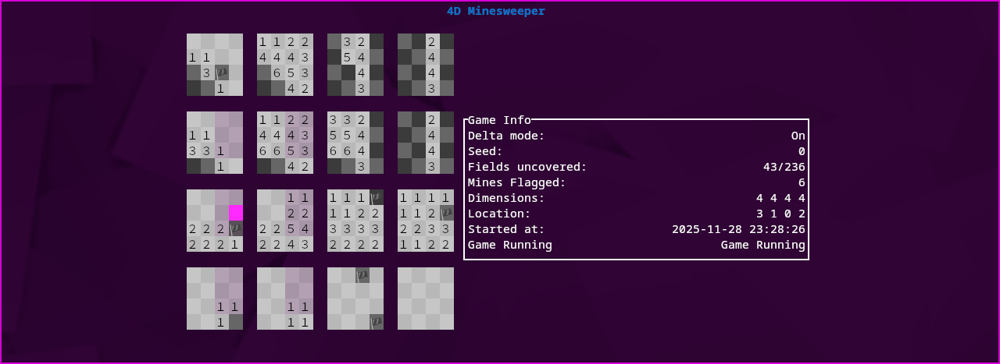

# minesweeper_4d

This is a [Ratatui] app and my 8th minesweeper variant, 7th multidimensional one (assuming the one I abandoned was supposed to be 4D), 4th public and 2nd (excluding the abandoned one) 1-4D one.

[Ratatui]: https://ratatui.rs



## How to play

You have to find all the mines in a 4 dimensional field. The pink cursor highlights the current field you're on and its value shows the number of bombs that are around it. To help you find which fields are in the area of influence of the cursor, they are highlighted in a less saturated shade of pink. Have fun finding all the mines!

### Controls

<pre>
  Move right in x:       right arrow, l
  Move left in x:        left arrow, h
  Move up in y:          up arrow, k
  Move down in y:        down arrow, j
  Move right in z:       d, ctrl-l
  Move left in z:        a, ctrl-h
  Move up in q:          w, ctrl-k
  Move down in y:        s, ctrl-j
  Mark bomb:             m, e
  Mark bomb chording:    M, E
  Uncover field:         space
  Find empty field:      f (only possible at the start of the game)
  Turn on delta mode:    u
  Give up/reveal field:  g
  Pause game:            p
  Open options:          o
  Start new game:        n
  Print controls:        c
  Toggle info:           i
  Quit game:             q
</pre>

## Compiling and running

Run:

```
cargo build
```

## TODO

- [x] Make swapping to and from delta_mode possible
- [x] Fix 0 showing around newly flagged mines
- [ ] Add timer
- [x] Fix win condition
- [ ] Make random seedable
- [x] Add chording
- [x] Editable settings

## License

Copyright (c) itabesamesa/laura418

This project is licensed under the MIT license ([LICENSE] or <http://opensource.org/licenses/MIT>)

[LICENSE]: ./LICENSE

## Special thanks

To Julian Schlüntz for creating [4D Minesweeper](https://store.steampowered.com/app/787980/4D_Minesweeper/) on steam, the original inspiration for this project
To [Ratatui](https://github.com/walternagl-student) for sparing from implementing a TUI library from scratch again...
