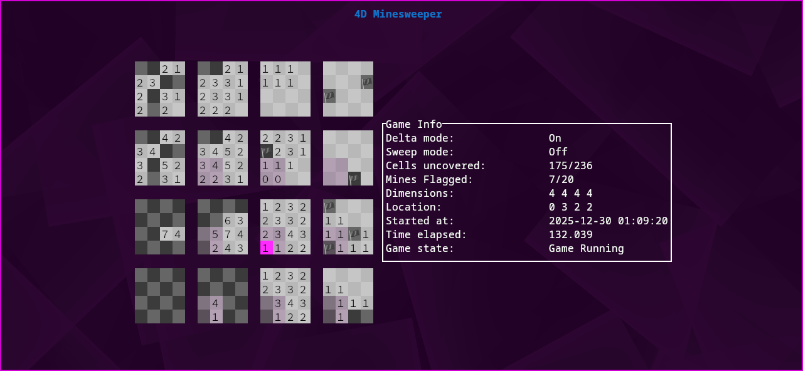

# minesweeper_4d

This is a [Ratatui] app and my 8th minesweeper variant, 7th multidimensional one (assuming all the ones I abandoned where at least supposed to be 4D), 4th public and 2nd (excluding the 3 abandoned ones) 4D one.

[Ratatui]: https://ratatui.rs




https://github.com/user-attachments/assets/d1e07569-e4ca-4f18-bfa0-eb96f0d7dc50


## How to play

You have to find all the mines in a 4 dimensional field. The pink cursor highlights the current field you're on and its value shows the number of bombs that are around it. To help you find which fields are in the area of influence of the cursor, they are highlighted in a less saturated shade of pink. Have fun finding all the mines!

In delta mode, each cell displays the amount of not yet flagged mines and 0, if there are covered cells in its area of influence.

In sweep mode, whenever you flag a mine, it will be removed. Other than that, it is similar to delta mode. When switching to sweep mode, all already flagged mines will be removed. Falsely flagged cells will end the game.

With marks you can visualise how many mines are in the area of influence. This is not meant to be used as a way to cheese the game, but rather to help one learn new tactics or for a beginner to get a better grasp on how 4D minesweeper works. The order in which you place marks is important! It can get a bit visually crowded when too many marks are placed, so remember to clear them. Marks overriding other marks is intended and should only happen if the amount of cells with that mark isn't fully enclosed by the newly placed mark


https://github.com/user-attachments/assets/913b4012-a483-4150-baad-a219c09b202e


When the program is run with `--capture_mouse t`, the cursor will track the mouse, left clicking will uncover a cell and right clicking will flag a cell. When the program crashes with capture_mouse on, you'll have to reset your terminal (this is why it is off by default)

There is the option of saving your game in a human readable file format. But I haven't tested it extensively. I only added it so that this variant would have every feature of [4d_minesweeper](https://github.com/itabesamesa/4d-minesweeper) in c. Files are saved to your downloads directory by default (run with `-h` and you'll see where that is).

In theory, this program should be OS agnostic (except for seeds https://docs.rs/rand/latest/rand/rngs/struct.StdRng.html ). But I have never tested this on anything other than Linux...

### Controls

<pre>
  Quit:                          ctrl+c, q, ESC
  Controls:                      c
  Settings:                      o
  Move left in x:                Leftarrow,  h
  Move right in x:               Rightarrow, l
  Move up in y:                  Uparrow,    k
  Move down in y:                Downarrow,  j
  Move left in z:                a, ctrl+h
  Move right in z:               d, ctrl+l
  Move up in w:                  w, ctrl+k
  Move down in w:                s, ctrl+j
  Move to start in x:            shift+Leftarrow,  H
  Move to end in x:              shift+Rightarrow, L
  Move to top in y:              shift+Uparrow,    K
  Move to bottom in y:           shift+Downarrow,  J
  Move to start in z:            A, alt+h
  Move to end in z:              D, alt+l
  Move to top in w:              W, alt+k
  Move to bottom in w:           S, alt+j
  Retry game:                    r
  New game:                      n
  Find free cell:                f
  Uncover cell:                  SPACE
  Give up/reveal field:          g
  Flag cell:                     m, e
  Flag cell chording:            M, E
  Pause game:                    p
  Toggle info:                   i
  Toggle delta mode:             u
  Toggle sweep mode:             U
  Clear all marks:               ctrl+x
  Flag obvious marked cells:     alt+x
  Mark cell:                     x
  Uncover obvious marked cells:  X
  Save game:                     ctrl+o
</pre>

## Compiling and running

```
cargo install minesweeper_4d
mkdir -p $HOME/.config/minesweeper_4d
curl https://raw.githubusercontent.com/itabesamesa/minesweeper_4d_rs/refs/heads/config/config.toml -o $HOME/.config/minesweeper_4d/config.toml
```

or

from source:

```
cargo install --path .
mkdir -p $HOME/.config/minesweeper_4d
cp ./config.toml $HOME/.config/minesweeper_4d/
```

Run:

```
minesweeper_4d
```

### Commandline arguments

<pre>
  -h,  -?, --help            Show this menu
  -d,  --dim, --dimension    Change field dimensions. An array of integers greater than 0 e.g.: -d 4 4 4 4
  -m,  --mines               Change amount of mines. An integer greater than 0
  -i,  --show_info           Toggle info box. A boolean value t/f or true/false or y/n or yes/no or on/off (any capitalisation)
  -u,  --delta_mode          Toggle delta mode. A boolean value t/f or true/false or y/n or yes/no or on/off (any capitalisation)
  -U,  --sweep_mode          Toggle sweep mode. A boolean value t/f or true/false or y/n or yes/no or on/off (any capitalisation)
  -s,  --seed                Set seed. An unsigned integer
  -r,  --random              Toggle random seed. A boolean value t/f or true/false or y/n or yes/no or on/off (any capitalisation)
  -cm, --capture_mouse       Wether to allow mouse interaction. A boolean value t/f or true/false or y/n or yes/no or on/off (any capitalisation)
  -c,  --config              Path of configuration file to use
  -o,  --dir                 Where to output save files. Default is "~/Downloads"
Default settings as a command
</pre>

Default settings as a command

```
minesweeper_4d -d 4 4 4 4 -m 20 -i t -u t -U f -r t -cm f
```

Classic Minesweeper as a command... Weirdo...

```
minesweeper_4d -d 16 16 1 1 -m 40 -i t -u f -U f -r t -cm t
```

## TODO

- [x] Make swapping to and from delta_mode possible
- [x] Fix 0 showing around newly flagged mines
- [x] Add timer ~_idk, kinda too lazy..._~
- [x] Fix win condition
- [x] ~~Make random seedable~~ hehe, i did it anyway :3
- [x] Add chording
- [x] Editable settings
- [x] Make Controls scrollable _custom implementation instead of ratatui Scrollbar_
- [ ] Make it possible to win when there are 0 mines
- [ ] Make game state message part of game instead of field

## License

Copyright (c) itabesamesa/laura418

This project is licensed under the MIT license ([LICENSE] or <http://opensource.org/licenses/MIT>)

[LICENSE]: ./LICENSE

## Special thanks

To Julian Schlüntz for creating [4D Minesweeper](https://store.steampowered.com/app/787980/4D_Minesweeper/) on steam, the original inspiration for this project

To [Ratatui](https://ratatui.rs) for sparing me from implementing a TUI library from scratch again...
